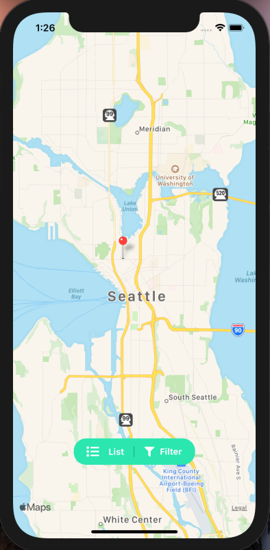

# Introducing FlixGrub

FlixGrub is an app to connect users with local drive in movie theaters in their area and give them the ability to view showtimes, purchase tickets, and even buy food while they're there!

Built with:
* [React Native (Hooks)](https://reactnative.dev/)
* [Express](https://expressjs.com/)
* [MongoDB Atlas](www.mongodb.com)

Testing:
* [Jest](https://jestjs.io/)

APIs
* [Yelp](https://www.yelp.com/developers)
* [Google Maps](https://developers.google.com/maps)

Requirements
=============
<h3>Installing Dependencies</h3>

From within the root directory: 
`npm install`

Development
=============
From within the root directory:

To run 
`npm run ios`

Demo
=============

## User Authentication: 
</img>

## List View: 
</img>

## Map View: 
</img>

## Profile Page: 
</img>
